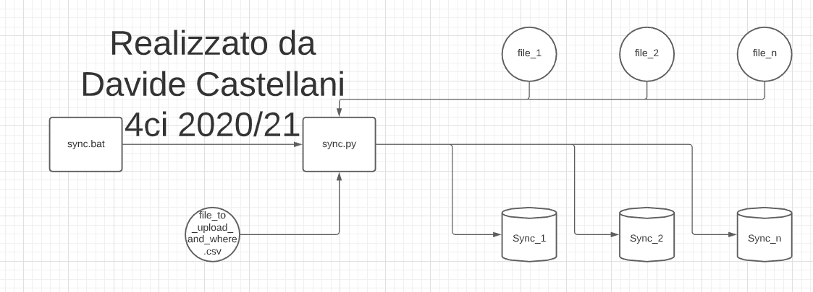

# sync
[](https://github.com/CastellaniDavide/cpp-sync/blob/master/LICENSE)     [](https://github.com/CastellaniDavide/sync)

## Description
Sync losts of projects.


## Goals
 - [x] Clone files segnalized in local.csv
 - [x] Add the sync in cloud option
 - [x] Add repo WebSite

## Required
 - python3
 - pip3 packages (in repo core ```pip install -r requirements\requirements.txt```)
 - setup file_to_upload_and_where.csv
 
## Directories structure
 - .github
   - ISSUE_TEMPLATE
     - bug_report.md
     - feature-request.md
 - bin
   - **sync.bat**
   - **sync.py**
 - docs
   - _config.yml
   - LICENSE
   - README.md
   - sync.png
 - flussi
   - cloned
     - ... <- auto created
   - file_to_upload_and_where.csv <- ***need setup***
 - log
   - trace.log
 - requirements
   - requirements.txt
   
### Execution examples (in bin folder)
 - python3 sync.py
 - .\sync.bat

# Changelog
 - [Version_02.01-2020-10-07](#Version_0201-2020-10-07)
 - [Version_01.01_2020-10-5](#Version_0101_2020-10-5)

## Version_02.01-2020-10-07
 - Fixed a bug
 - Add the sync in cloud option
 - Add repo WebSite

## Version_01.01_2020-10-5
 - Clone files segnalized in local.csv

---
Made by Castellani Davide 
If you have any problem please contact me:
- help@castellanidavide.it
- [Issue](https://github.com/CastellaniDavide/sync/issues)
